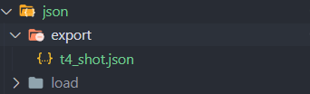
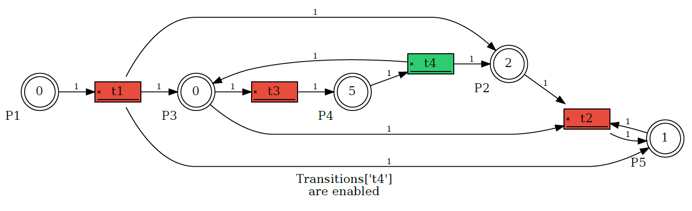

# PNetWork-SD

- Basic Petri Network, based on the book [Petri Net Theory an The Modeling of Systems](https://www.amazon.com/Petri-Net-Theory-Modeling-Systems/dp/0136619835) 
- The structure of the project are these class
    ```sh
        json/
    ├── export
    │   └── t4_shot.json
    └── load
        └── petri_network.json
    sources/
    ├── f-215.PNG
    ├── f-216.PNG
    ├── f-217.PNG
    ├── f-218.PNG
    ├── graph_example.PNG
    └── json_export_example.PNG
    ├───.gitignore
    ├───Graph.py
    ├───Petri.py
    ├───PetriEngine.py
    ├───README.md
    └───app.py
    ```
## Class
___
### Petri.py
- The main module, this module contains the next class:
  1. **Transitions**: transitions of the net. 
  2. **Places**: places of the net. 
  3. **Itransitions**: inputs transitions. 
  4. **Otransitions**: outputs transitions.
  5. **PetriNetwork**: contains the net in general.
     - This class allow handled the net, throught the methods add places,transitions,tokens...etc
  - as well contains specific methods that allow you **load** and **export** pnet configuration in _json_ file, 
    - To load a petri network from json file use the method `json_load` and save the json file in the route ./json/load/* and only pass the name of the file (don't send extension):
      ```python
      petri = PetriNetwork().json_load('petri_network')
      ``` 
    - if you want to export use the method `json_export` given one argument that is the name of transition that was shooted (don't send extension) and this ill' save in the route ./json/exports/* this come by _default_ in the **_PetriEngine_**
     
      

### PetriEngine.py
- This module contains:
   
   - **PetriEngine**: Is the engine that allows handled the net with methods like `shot transition` and `next transition`, also verify transitions enabled with `check_state_transition` and wheter you need verify all transitions available only use `check_enable_transitions`. 
       - Return the inputs transitions, output transitions and start the game. Fire according to ordens given for the user.
       - Allow update states of transitions, and raise errors after validation if the transition is enabled to shoot.
       - Allow get the $D^ -$ and $D^ +$ with the methods `get_dmatrix_min` and `get_dmatrix_plus`.
       - `get_elements_to_shoot` return you the three elements most important of the pnet, like **marks** or **tokens**, **arcs** by place for inputs and outputs.
       - Another important method is `get_e_j` this return $e[j]$ vector according to transition.
### Graph.py
- This module allow graphing, passing the pnet, this returns in green the enable transitions and red the blocked transitions. you can pass the next arguments:
  - _**name**: identifier of the graph.
  - _**_rankdir**: attribute of the node, for example `[LR, TB, same]`.
  - _**_size**: size of the plot, put in string, ex = `'9,6'` or `'10,8'`.
  - _**_shapet**: shape of the transitions.
  - _**_shapep**: sshape of the places.
- more details, see the library [graphviz-documentation]('https://graphviz.readthedocs.io/en/stable/index.html')
- An example of ouput
  
### app.py
- Is the module main, load by default a static network and call the PetriEngine and execute the process.

## Example Net
___
- According the example book, in the page 37 and fig 2.15, the `app.py` file is preload with this initial configuration.
    ```python
    # Initial structure
    Estructura Inicial 🚀
    C= (P,T,I,O)
    P= ['p1', 'p2', 'p3', 'p4', 'p5']
    T= ['t1', 't2', 't3', 't4']

    Inputs
    I(t1) = { p1 : 1 } 
    I(t2) = { p2 : 0 } { p3 : 0 } { p4 : 2 } 
    I(t3) = { p4 : 2 } 
    I(t4) = { p5 : 1 } 

    Outputs
    O(t1) = { p4 : 2 } { p3 : 0 } { p2 : 0 } 
    O(t2) = { p2 : 0 } 
    O(t3) = { p5 : 1 } 
    O(t4) = { p4 : 2 } { p3 : 0 } 
    -----------------------------------------------------
    ```   
- Graphic representation in initial marking 
- Resulting from: fire **t4** 
- Resulting from: fire **t1** 
- Resulting from: fire **t3**