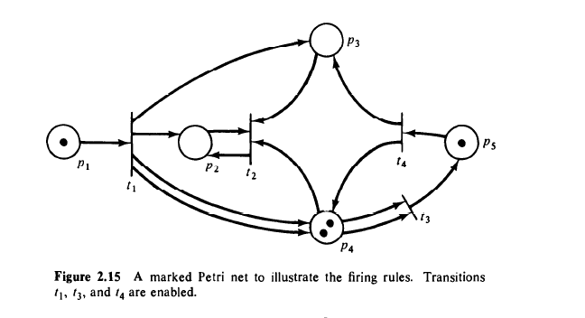
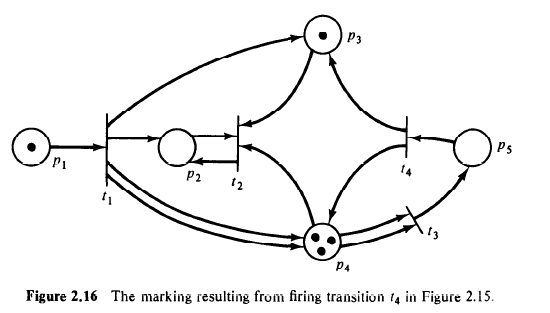
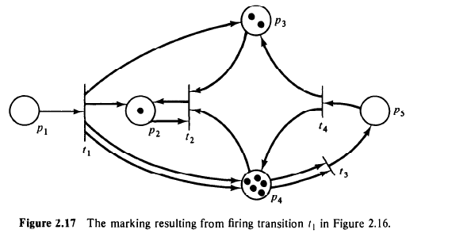
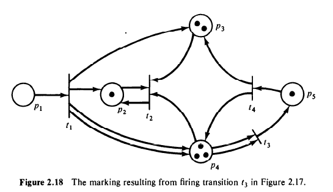

# PNetWork-SD

- Basic Petri Network, based on the book [Petri Net Theory an The Modeling of Systems](https://www.amazon.com/Petri-Net-Theory-Modeling-Systems/dp/0136619835) 
- The structure of the project are these class
    ```sh
    ├───Petri.py
    ├───PetriEngine.py
    ├───README.md
    └───app.py
    ```
## Class
___
### Petri.py
- The main module, this module contains the next class:
  1. **Transitions**: transitions of the net. 
  2. **Places**: places of the net. 
  3. **Itransitions**: inputs transitions. 
  4. **Otransitions**: outputs transitions.
  5. **PetriNetwork**: contains the net in general.
     - This class allow handled the net, throught the methods add places,transitions,tokens...etc
### PetriEngine.py
- This module contains:
  1. **PetriEngine**: Is the engine that allows handled the net with methods that `shot transition` and `next transition`. 
       - return the inputs transitions, output transitions and start the game, fire according to ordens given for the user.
       - allow update states of transitions, and raise errors after validate if the transition is enabled to shoot.
### app.py
- Is the module main, load by default a static network and call the PetriEngine and execute the process.

## Example Net
___
- According the example book, in the page 37 and fig 2.15, the `app.py` file is preload with this initial configuration.
    ```python
    # Initial structure
    Estructura Inicial 🚀
    C= (P,T,I,O)
    P= ['p1', 'p2', 'p3', 'p4', 'p5']
    T= ['t1', 't2', 't3', 't4']

    Inputs
    I(t1) = { p1 : 1 } 
    I(t2) = { p2 : 0 } { p3 : 0 } { p4 : 2 } 
    I(t3) = { p4 : 2 } 
    I(t4) = { p5 : 1 } 

    Outputs
    O(t1) = { p4 : 2 } { p3 : 0 } { p2 : 0 } 
    O(t2) = { p2 : 0 } 
    O(t3) = { p5 : 1 } 
    O(t4) = { p4 : 2 } { p3 : 0 } 
    -----------------------------------------------------
    ```   
- Graphic representation in initial marking 
- Resulting from: fire **t4** 
- Resulting from: fire **t1** 
- Resulting from: fire **t3**